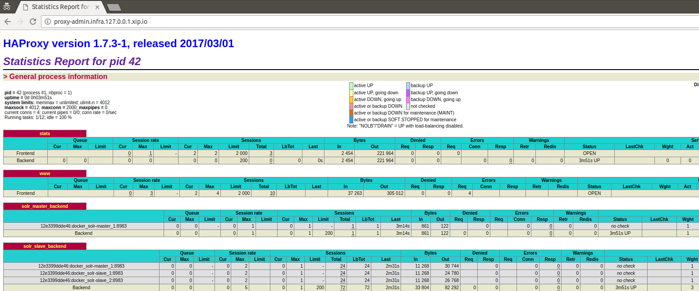
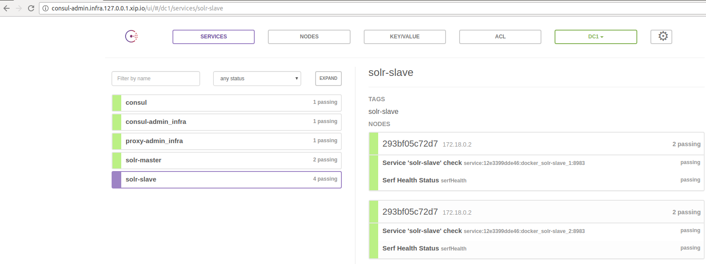
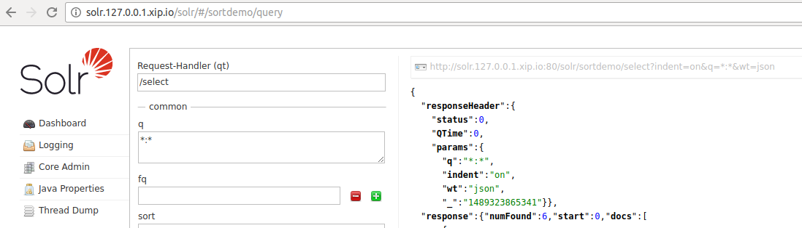

Solr Load Balancing
===================


This is just a summary of the modifications needed
to enable load balancing on Solr in case i forgot in a few months how to do it.


Load balancing is made possible by using [haproxy](http://www.haproxy.org/)

Solr Replication is done by following the [Solr Replication Guideline](https://wiki.apache.org/solr/SolrReplication)

## Local

Once everything is set on the localhost:

- haproxy is installed and configured accordingly to local/haproxy/haproxy.cfg
- the replication is enabled on the solr master and configured on the solr slave instances

, the haproxy statistics can be seen on the page:

http://localhost/haproxy?stats


I started the master solr with

```
   $ bin/solr start -p 8984
```

and the slave solr with 

```
   $ bin/solr start -p 8985
```


## Docker

Via Docker, it is easier to see what this example is about.
In the directory docker/ there are a few things to take into consideration:

- haproxy/haproxy.cfg takes into account the names of the containers solr-master and solr-slave for the network connectivity
- in the file solr/slave/sortdemo/conf/solrconfig.xml the masterUrl for the replicationHandler is referencing solr-master host

Starting up the ecosystem is done via 

```
  docker$ sudo docker-compose -f consul.yml up -d
```

This command will start the following instances:

- docker_lb : the haproxy instance linked to consul
- progrium/consul : the consul-template instance
- gliderlabs/registrator : service registry bridge for Docker

The code required is taken with small modifications (for supporting solr master and slaves behind the same host) on the haproxy.tmpl 
file as it is from [docker-consul-demo](https://github.com/camptocamp/docker-consul-demo) repository.


Once the load balancing infrastructure is in place, the next step is to load the solr master and slave instance(s).

```
  docker$ docker$ sudo docker-compose up -d
```


In order to scale the solr slave instance, just run the following command


```
  docker$ docker$ sudo docker-compose scale solr-slave=2
```


The exposed URLs are:

- http://solr.127.0.0.1.xip.io all the solr host are mapped under this host
- http://solr-master.127.0.0.1.xip.io the solr host where the update operations land on
- http://solr-slave.127.0.0.1.xip.io the solr host(s) where the read operations land on
- http://proxy-admin.infra.127.0.0.1.xip.io haproxy statistics page
- http://consul-admin.infra.127.0.0.1.xip.io/ consul statistics page

Once everything is setup, you should see the haproxy and consul statistics:





as well as executing solr queries




## Test data

```

# query will be handled by solr-master
curl http://solr.127.0.0.1.xip.io/solr/sortdemo/update?commitWithin=3000 -d '
[
  {
    "id": "2014_1",
    "name": "Tyrion",
    "city": "New York",
    "year" : 2014,
    "month" : 1
  },
  {
    "id": "2015_2",
    "name": "John",
    "city": "New York",
    "year" : 2015,
    "month" : 2
  },
  {
    "id": "2014_2",
    "name": "Marc",
    "city": "San Francisco",
    "year" : 2014,
    "month" : 2
  },
  {
    "id": "2014_5",
    "name": "Mary",
    "city": "San Jose",
    "year" : 2014,
    "month" : 5
  },
  {
    "id": "2013_4",
    "name": "Barry",
    "city": "New Hampshire",
    "year" : 2013,
    "month" : 4
  },
  {
    "id": "2016_5",
    "name": "Betty",
    "city": "Cincinatti",
    "year" : 2015,
    "month" : 5
  }
]'


# query will be handled by solr-master
curl http://solr.127.0.0.1.xip.io/solr/sortdemo/update?commitWithin=3000 -d '
[
  {
    "id": "201x_1",
    "name": "No Year",
    "city": "New York",
    "month" : 1
  },
  {
    "id": "2014_x",
    "name": "No Month",
    "city": "New York",
    "year" : 2014
  }
]'


# query will be handled by one of the solr slaves
curl http://solr.127.0.0.1.xip.io/solr/sortdemo/select?indent=on&q=*:*&sort=city%20asc,%20name%20asc&wt=json

```


## Open issues

The number of slaves used can be scaled up and down with a simple command on docker compose,
but there are a few issues that should still be handled to make such a prototype production ready.

First of all, when scaling up the solr slaves, they are immediately accessible in the cluster,
even though they are not warmed with the data existent on the master solr instance.
This is why the number of results for a search query may vary very much, depending on the replication
state of the solr slave.

Another point is that haproxy doesn't support at the time of this writing reconfiguration of the
backend servers without a restart (this is why after scaling up / down the solr slaves can be seen a different PID
for the haproxy process compared to the previous one). I suppose that such an operation comes also with
dropped requests.


## Projects used in coming up with this PoC

* https://github.com/camptocamp/docker-consul-demo
* https://github.com/camptocamp/docker-haproxy-consul
* https://github.com/hashicorp/consul-template
* https://github.com/docker-solr/docker-solr/